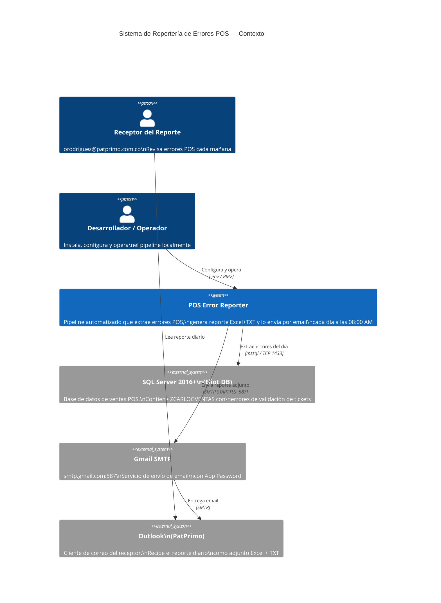
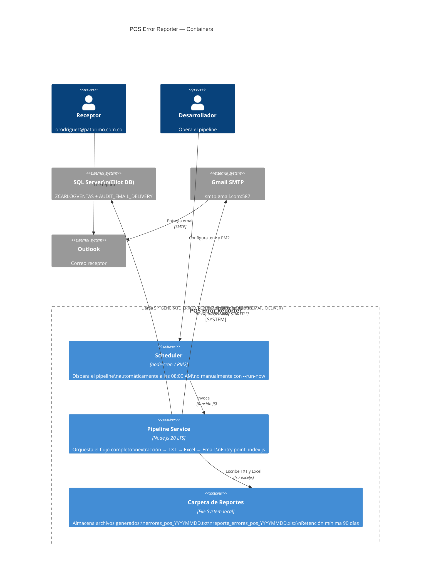
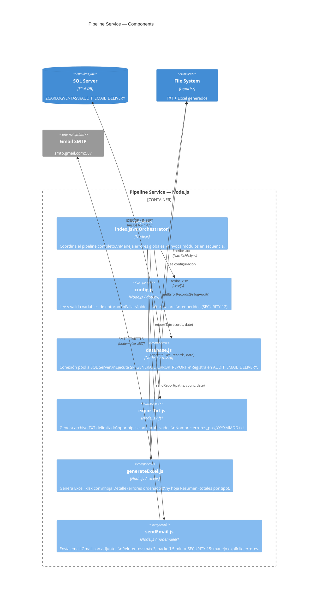

# C4 Diagrams — POS Error Reporter
## Sistema Automatizado de Reportería de Errores POS — Manufacturas Eliot

---

## Nivel 1 — Context

---

## Nivel 2 — Container

---

## Nivel 3 — Component (Pipeline Service)

---

## Resumen de tecnologías

| Nivel | Componente | Tecnología |
|---|---|---|
| Container | Pipeline Service | Node.js 20 LTS |
| Container | Scheduler | node-cron + PM2 |
| Container | Reportes | File System local |
| Externo | Base de datos | SQL Server 2016+ |
| Externo | Email salida | Gmail SMTP (nodemailer) |
| Externo | Email entrada | Outlook (PatPrimo) |
| Componente | Config | dotenv |
| Componente | BD Driver | mssql |
| Componente | Excel | exceljs |
