# Execution Plan
## Sistema Automatizado de Reportería de Errores POS — Manufacturas Eliot

---

## Detailed Analysis Summary

### Change Impact Assessment

| Área | ¿Aplica? | Descripción |
|---|---|---|
| **User-facing changes** | Sí | Los directivos reciben un email diario automatizado en lugar del reporte manual |
| **Structural changes** | Sí | Nuevo servicio Node.js + nuevas tablas/SP en SQL Server existente |
| **Data model changes** | Sí | Nueva tabla `AUDIT_EMAIL_DELIVERY`, nuevo SP `SP_GENERATE_ERROR_REPORT` |
| **API changes** | No | No se exponen APIs externas en esta fase |
| **NFR impact** | Sí | Compliance NIIF/DIAN/Habeas Data; 15 reglas SECURITY habilitadas |

### Risk Assessment

| Dimensión | Nivel | Justificación |
|---|---|---|
| **Risk Level** | Medium | Múltiples componentes; integración Gmail SMTP nueva; esquema ZCARLOGVENTAS aún no confirmado |
| **Rollback Complexity** | Easy | Deshabilitar SQL Agent job + detener PM2 service; sin cambios destructivos en tablas existentes |
| **Testing Complexity** | Moderate | Requiere SQL Server real + SMTP fake (MailHog) para pruebas e2e |

---

## Workflow Visualization

### Text Alternative (referencia rápida)

```
[START] User Request
    |
    v
INCEPTION PHASE
    [x] Workspace Detection        — COMPLETED
    [SKIP] Reverse Engineering     — SKIPPED (Greenfield)
    [x] Requirements Analysis      — COMPLETED
    [x] User Stories               — COMPLETED
    [x] Workflow Planning          — IN PROGRESS
    [ ] Application Design         — EXECUTE
    [ ] Units Generation           — EXECUTE (2 units)
    |
    v
CONSTRUCTION PHASE
    — Unit 1: SQL Server Data Layer —
    [ ] Functional Design          — EXECUTE
    [ ] NFR Requirements           — EXECUTE
    [ ] NFR Design                 — EXECUTE
    [ ] Infrastructure Design      — EXECUTE
    [ ] Code Generation            — EXECUTE (ALWAYS)
    — Unit 2: Node.js Pipeline Service —
    [ ] Functional Design          — EXECUTE
    [ ] NFR Requirements           — EXECUTE
    [ ] NFR Design                 — EXECUTE
    [ ] Infrastructure Design      — EXECUTE
    [ ] Code Generation            — EXECUTE (ALWAYS)
    — Post-units —
    [ ] Build and Test             — EXECUTE (ALWAYS)
    |
    v
OPERATIONS PHASE
    [ ] Operations                 — PLACEHOLDER
    |
    v
[END] Complete
```

### Mermaid Diagram

```mermaid
flowchart TD
    Start(["User Request"])

    subgraph INCEPTION["INCEPTION PHASE"]
        WD["Workspace Detection\nCOMPLETED"]
        RE["Reverse Engineering\nSKIPPED"]
        RA["Requirements Analysis\nCOMPLETED"]
        US["User Stories\nCOMPLETED"]
        WP["Workflow Planning\nIN PROGRESS"]
        AD["Application Design\nEXECUTE"]
        UG["Units Generation\nEXECUTE"]
    end

    subgraph CONSTRUCTION["CONSTRUCTION PHASE"]
        subgraph UNIT1["Unit 1: SQL Server Data Layer"]
            FD1["Functional Design\nEXECUTE"]
            NFR1["NFR Requirements\nEXECUTE"]
            NFRD1["NFR Design\nEXECUTE"]
            ID1["Infrastructure Design\nEXECUTE"]
            CG1["Code Generation\nEXECUTE"]
        end
        subgraph UNIT2["Unit 2: Node.js Pipeline Service"]
            FD2["Functional Design\nEXECUTE"]
            NFR2["NFR Requirements\nEXECUTE"]
            NFRD2["NFR Design\nEXECUTE"]
            ID2["Infrastructure Design\nEXECUTE"]
            CG2["Code Generation\nEXECUTE"]
        end
        BT["Build and Test\nEXECUTE"]
    end

    subgraph OPERATIONS["OPERATIONS PHASE"]
        OPS["Operations\nPLACEHOLDER"]
    end

    Start --> WD --> RE --> RA --> US --> WP --> AD --> UG
    UG --> FD1 --> NFR1 --> NFRD1 --> ID1 --> CG1
    UG --> FD2 --> NFR2 --> NFRD2 --> ID2 --> CG2
    CG1 --> BT
    CG2 --> BT
    BT -.-> OPS
    BT --> End(["Complete"])

    style WD fill:#4CAF50,stroke:#1B5E20,stroke-width:3px,color:#fff
    style RA fill:#4CAF50,stroke:#1B5E20,stroke-width:3px,color:#fff
    style US fill:#4CAF50,stroke:#1B5E20,stroke-width:3px,color:#fff
    style WP fill:#4CAF50,stroke:#1B5E20,stroke-width:3px,color:#fff
    style RE fill:#BDBDBD,stroke:#424242,stroke-width:2px,stroke-dasharray:5 5,color:#000
    style AD fill:#FFA726,stroke:#E65100,stroke-width:3px,stroke-dasharray:5 5,color:#000
    style UG fill:#FFA726,stroke:#E65100,stroke-width:3px,stroke-dasharray:5 5,color:#000
    style FD1 fill:#FFA726,stroke:#E65100,stroke-width:3px,stroke-dasharray:5 5,color:#000
    style NFR1 fill:#FFA726,stroke:#E65100,stroke-width:3px,stroke-dasharray:5 5,color:#000
    style NFRD1 fill:#FFA726,stroke:#E65100,stroke-width:3px,stroke-dasharray:5 5,color:#000
    style ID1 fill:#FFA726,stroke:#E65100,stroke-width:3px,stroke-dasharray:5 5,color:#000
    style CG1 fill:#4CAF50,stroke:#1B5E20,stroke-width:3px,color:#fff
    style FD2 fill:#FFA726,stroke:#E65100,stroke-width:3px,stroke-dasharray:5 5,color:#000
    style NFR2 fill:#FFA726,stroke:#E65100,stroke-width:3px,stroke-dasharray:5 5,color:#000
    style NFRD2 fill:#FFA726,stroke:#E65100,stroke-width:3px,stroke-dasharray:5 5,color:#000
    style ID2 fill:#FFA726,stroke:#E65100,stroke-width:3px,stroke-dasharray:5 5,color:#000
    style CG2 fill:#4CAF50,stroke:#1B5E20,stroke-width:3px,color:#fff
    style BT fill:#4CAF50,stroke:#1B5E20,stroke-width:3px,color:#fff
    style OPS fill:#BDBDBD,stroke:#424242,stroke-width:2px,stroke-dasharray:5 5,color:#000
    style Start fill:#CE93D8,stroke:#6A1B9A,stroke-width:3px,color:#000
    style End fill:#CE93D8,stroke:#6A1B9A,stroke-width:3px,color:#000
    style INCEPTION fill:#BBDEFB,stroke:#1565C0,stroke-width:3px,color:#000
    style CONSTRUCTION fill:#C8E6C9,stroke:#2E7D32,stroke-width:3px,color:#000
    style OPERATIONS fill:#FFF59D,stroke:#F57F17,stroke-width:3px,color:#000

    linkStyle default stroke:#333,stroke-width:2px
```



---

## Phases to Execute

### INCEPTION PHASE

- [x] Workspace Detection — **COMPLETED**
- [x] Reverse Engineering — **SKIPPED** (Greenfield — sin código existente)
- [x] Requirements Analysis — **COMPLETED**
- [x] User Stories — **COMPLETED** (7 historias, 2 personas, 5 feature groups) — RESTART
- [x] Workflow Planning — **IN PROGRESS**
- [ ] Application Design — **EXECUTE**
  - **Rationale**: Se necesitan nuevos componentes (ErrorReportService, módulos Node.js, SP SQL Server). Los métodos, responsabilidades y dependencias entre componentes deben definirse antes del código.
- [ ] Units Generation — **EXECUTE**
  - **Rationale**: El proyecto tiene dos capas de desarrollo independientes que pueden paralelizarse: (1) SQL Server Data Layer y (2) Node.js Pipeline Service. Decomponerlas permite asignación de trabajo al Arquitecto SQL y al Backend Developer en paralelo.

### CONSTRUCTION PHASE

#### Unit 1: SQL Server Data Layer

- [ ] Functional Design — **EXECUTE**
  - **Rationale**: La lógica del SP `SP_GENERATE_ERROR_REPORT` y el esquema de `AUDIT_EMAIL_DELIVERY` requieren diseño detallado (columnas, índices, tipos de dato, lógica de filtrado de errores).
- [ ] NFR Requirements — **EXECUTE**
  - **Rationale**: Compliance DIAN/NIIF requiere definir retención de datos, append-only para auditoría, cifrado TDE.
- [ ] NFR Design — **EXECUTE**
  - **Rationale**: Los patrones NFR (índices de performance, política de particionado, retención 3 años) deben diseñarse antes de escribir el DDL.
- [ ] Infrastructure Design — **SKIP**
  - **Rationale**: SQL Server 2016+ ya existe en entorno local. Solo se agregan SP y tabla; sin SQL Agent job, sin cloud resources, sin deployment architecture requerida.
- [ ] Code Generation — **EXECUTE** (ALWAYS)

#### Unit 2: Node.js Pipeline Service

- [ ] Functional Design — **EXECUTE**
  - **Rationale**: La lógica de orquestación del pipeline (flujo de módulos, manejo de errores, retry con backoff) y el formato exacto del Excel/CSV requieren diseño detallado.
- [ ] NFR Requirements — **EXECUTE**
  - **Rationale**: SECURITY-03 (logging sin PII), SECURITY-12 (credenciales Gmail en .env), SECURITY-15 (manejo explícito errores BD+SMTP). Performance <5 min. Solo reglas habilitadas en RESTART.
- [ ] NFR Design — **EXECUTE**
  - **Rationale**: Patrones concretos para logging estructurado seguro, gestión de credenciales via dotenv, y retry SMTP con backoff de 5 min.
- [ ] Infrastructure Design — **SKIP**
  - **Rationale**: Ejecución local en máquina del desarrollador. PM2/node-cron es configuración de aplicación, no infraestructura. Sin staging/prod, sin Windows Server deployment, sin cloud resources.
- [ ] Code Generation — **EXECUTE** (ALWAYS)

#### Post-units

- [ ] Build and Test — **EXECUTE** (ALWAYS)
  - **Rationale**: Instrucciones de build (npm install, scripts SQL), pruebas unitarias (Jest ≥70%), integración (Jest + SQL Server), e2e (MailHog), performance y UAT con directivos.

### OPERATIONS PHASE

- [ ] Operations — **PLACEHOLDER**
  - **Rationale**: Reservado para expansión futura (deployment pipelines, monitoring dashboards).

---

## Units Definition

### Unit 1: SQL Server Data Layer
**Responsable**: Arquitecto de Datos / SQL Sr.
**Componentes**:
- `SP_GENERATE_ERROR_REPORT` (T-SQL Stored Procedure)
- `AUDIT_EMAIL_DELIVERY` (tabla + índices)
- Scripts DDL de creación y rollback
- SQL Server Agent job configuration script

### Unit 2: Node.js Pipeline Service
**Responsable**: Backend Developer (Node.js)
**Componentes**:
- `ErrorReportService` — orquestador del pipeline
- `flatFileExporter` — módulo CSV
- `excelGenerator` — módulo XLSX con estilos
- `emailSender` — módulo nodemailer + retry
- `auditLogger` — módulo escritura AUDIT_EMAIL_DELIVERY
- `config` — módulo variables de entorno + validación
- `index.js` / entry point (PM2)
- Tests unitarios (Jest)

---

## Estimated Timeline

| Fase | Duración estimada | Semanas |
|---|---|---|
| Application Design | 1-2 días | Sem 1 |
| Units Generation | 0.5 días | Sem 1 |
| Unit 1 — Full (FD + NFR + Infra + Code) | 1 semana | Sem 1-2 |
| Unit 2 — Full (FD + NFR + Infra + Code) | 1.5 semanas | Sem 1-3 |
| Build and Test | 1 semana | Sem 3-4 |
| **Total MVP (Fase 1)** | **~4 semanas** | **Sem 1-4** |

---

## Success Criteria

- **Primary Goal**: Pipeline automático a las 08:00 AM entregando reporte Excel a orodriguez@patprimo.com.co
- **Key Deliverables**: SP_GENERATE_ERROR_REPORT, AUDIT_EMAIL_DELIVERY, ErrorReportService, reporte Excel (Detalle + Resumen), TXT pipes, email Gmail→Outlook
- **Quality Gates**:
  - Tests unitarios ≥ 60% cobertura lógica de negocio (Jest)
  - Pipeline completa en <5 minutos para ≤250 errores/día
  - 0 credenciales hardcodeadas en código fuente (SECURITY-12)
  - Logs sin PII ni credenciales (SECURITY-03)
  - Errores BD + SMTP manejados explícitamente (SECURITY-15)
  - Todos los envíos registrados en AUDIT_EMAIL_DELIVERY

---

## Security Compliance Summary (Workflow Planning)

| Regla | Estado | Observación |
|---|---|---|
| SECURITY-03 (Logging estructurado sin PII) | Compliant | Plan incluye logging estructurado; sin PII. Se verificará en Construction. |
| SECURITY-12 (Credenciales en .env) | Compliant | Requirements mandatan .env para Gmail App Password; sin hardcoding. |
| SECURITY-15 (Exception handling) | Compliant | Plan incluye retry SMTP + manejo explícito BD/SMTP. Se verificará en Construction. |
| SECURITY-01,02,04-11,13,14 | N/A | Deshabilitadas en RESTART (entorno local/MVP; sin cloud, API, web, ni IAM) |
